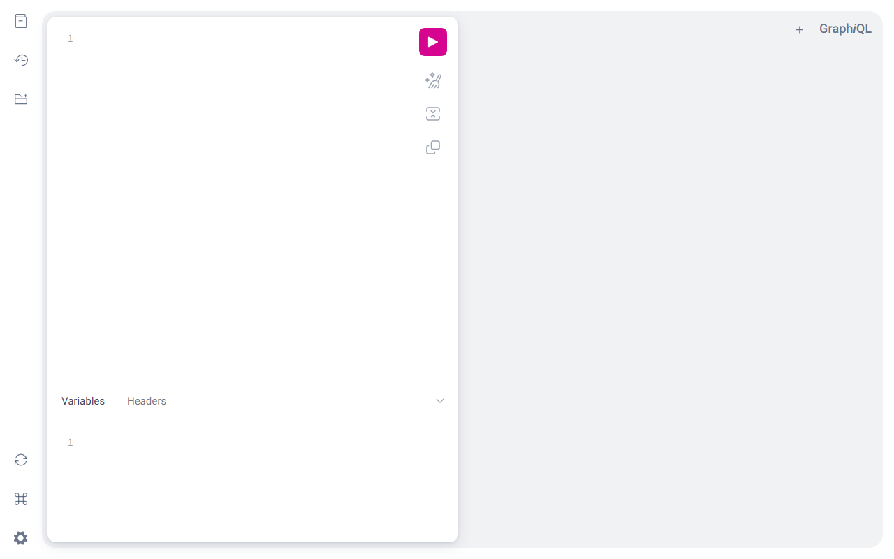

# Sales Management System

A Laravel 10 sales-management demo API built around the Biztory invoicing dataset. It stores
sales (with soft deletes), totals daily sales over a date range through both a REST endpoint
and a Lighthouse GraphQL mutation, and fires a queued + broadcast `InvoiceCreated` event on
every sale creation that is logged to `storage/logs/invoice.log`.

> [!IMPORTANT]
> **Data requires MySQL.** The repo's migrations create framework tables only — the app's
> `sales`/`users` tables ship **exclusively** in the MySQL dump [`biztory.sql`](biztory.sql).
> On the default sqlite setup from the quick start below, the server boots, the welcome page
> and the [GraphiQL IDE](#api-examples) load, and request validation returns proper 422s —
> but every endpoint that touches data 500s with `no such table: sales`. (The PHPUnit
> suite is unaffected: it runs green on sqlite `:memory:` with test-only schema
> scaffolding — see [Testing](#testing).) To exercise the data endpoints, import the dump
> into a MySQL server:
>
> ```powershell
> mysql -u root -p < biztory.sql   # the dump CREATEs and fills the `biztory` database itself
> ```
>
> then in `.env` restore `DB_CONNECTION=mysql` and the `DB_HOST` / `DB_PORT` /
> `DB_DATABASE=biztory` / `DB_USERNAME` / `DB_PASSWORD` lines (`.env.example`'s original
> defaults), enable `extension=pdo_mysql` in `%LOCALAPPDATA%\Programs\php-8.3\php.ini`
> (shipped commented out in the pinned PHP), and restart with `just stop` + `just start`.

> **New developer? Start with [`.docs/tldr.md`](.docs/tldr.md)** — every doc summarised on one
> page. The full guide lives in [`.docs/`](.docs/README.md).

## Prerequisites

| Tool | Version | Installed by |
| --- | --- | --- |
| PowerShell + winget | Windows 10/11 stock | — (the only true prerequisites) |
| Git | any recent | `setup.ps1` |
| PHP | 8.3 (pinned — `composer.lock` rejects 8.4) | `setup.ps1` |
| Composer | 2.x | `setup.ps1` |
| Node.js | LTS (Vite asset build) | `setup.ps1` |
| uv | latest | `setup.ps1` |
| just | any recent | `setup.ps1` |
| Claude Code CLI | latest | `setup.ps1` (optional, for AI-assisted dev) |

## Quick start

```powershell
# 1. One-time machine setup (idempotent — safe to re-run)
pwsh ./setup.ps1

# 2. Close and reopen PowerShell so PATH updates land

# 3. One-time app bootstrap: composer + npm deps, sqlite .env, migrate, Vite build
just bootstrap

# 4. Start the dev server
just start
```

The app is now at **http://127.0.0.1:8111**. Stop it with `just stop`.

## Commands

Run `just` with no arguments to list every recipe. The ones you'll use daily:

| Command | What it does |
| --- | --- |
| `just bootstrap` | One-time app bootstrap: deps, sqlite `.env`, migrate, asset build |
| `just start` | Serve on http://127.0.0.1:8111 in a background window |
| `just serve` | Serve in the foreground (Ctrl+C to stop) |
| `just stop` | Stop only THIS repo's `php.exe` processes |
| `just migrate` | Run pending migrations |
| `just fresh` | Drop everything and re-migrate + seed (irreversible locally) |
| `just test` | Run the full PHPUnit suite (Unit + Feature) on sqlite `:memory:` — green without MySQL ([Testing](#testing)) |
| `just lint` | Check code style with Laravel Pint (read-only) |
| `just lint-fix` | Auto-fix code style with Laravel Pint |
| `just claudex` | Launch Claude Code (Sonnet, all permissions) |

## Testing

`just test` runs the full PHPUnit suite (Unit + Feature) on **sqlite `:memory:`**
(`phpunit.xml` pins `DB_CONNECTION`/`DB_DATABASE`), so it needs no MySQL and never
touches your local database file.

The app's `sales`/`users` tables ship only in `biztory.sql` — the repo's migrations are
framework-only, on purpose — so the suite historically failed with
`no such table: sales` (the old "4 baseline failures"). It is now green via **test-only
schema scaffolding**: `tests/TestCase.php` creates minimal copies of the two tables per
test (columns cross-checked against the dump's `CREATE TABLE` statements) and seeds the
one user row (`id` 506) the GraphQL test filters on. This is test infrastructure, not an
app change — migrations and the app schema are untouched, and the running app's
MySQL-required behavior is unchanged.

`phpunit.xml` also sets `LIGHTHOUSE_SCHEMA_CACHE_ENABLE=false`, because
`config/lighthouse.php` caches the compiled schema to `bootstrap/cache/lighthouse-schema.php`
for every `APP_ENV` but `local` — without it the suite would assert against a stale
schema and silently ignore edits to `graphql/*.graphql`.

**55 tests / 227 assertions**, all green:

| Suite | Test | Covers |
| --- | --- | --- |
| Unit | `CountDailySalesControllerTest` | Exact REST totals for each filter combination over a seeded ledger |
| Unit | `GraphQLDailyTest` | Exact GraphQL totals via the relative `/graphql` route |
| Unit | `FactoryStoreSalesTest` | `GET /api/store-sale` |
| Unit | `StoreSaleControllerTest` | `POST /api/sales` persists the payload |
| Unit | `LogInvoiceCreatedTest` | The listener writes to the `invoice` log channel; it is registered for the event |
| Feature | `RestGraphqlParityTest` | REST ⇄ GraphQL twin parity across every filter shape |
| Feature | `SaleSoftDeleteTest` | Soft-deleted sales leave both totals; `restore()` / `forceDelete()` |
| Feature | `InvoiceCreatedEventTest` | `InvoiceCreated` dispatch, the `invoice` broadcast channel, nothing dispatched on 422 |
| Feature | `DailySaleValidationTest` | The bare `{"errors": …}` 422 contract and the GraphQL `@rules` twin |
| Feature | `StoreSaleValidationTest` | Every `StoreSaleRequest` rule rejects and persists nothing |
| Feature | `CountDailySalesTest`, `StoreSaleTest` | Original happy paths + the fixed filter regressions |

The filter regressions worth knowing: leaving `payment_status`/`payee_id` out of the
body used to 500 with `Undefined array key "payment_status"`; the old truthy check
silently dropped a legitimate `payment_status=0` (unpaid) filter; and the GraphQL twin
rejected the null/empty `payee_id` REST accepts as "no filter". Both twins now use the
identical `isset($x) && $x !== ''` guard, and `RestGraphqlParityTest` fails if they
drift apart again.

## API examples

Everything below runs against `just start` (`http://127.0.0.1:8111`). The requests and the
sqlite responses were captured live from this repo; the MySQL response shapes are read
straight off the schema and resolvers ([`graphql/sale.graphql`](graphql/sale.graphql),
[`app/GraphQL/Mutations/DailyTotalSales.php`](app/GraphQL/Mutations/DailyTotalSales.php),
[`app/Http/Controllers/CountDailySalesController.php`](app/Http/Controllers/CountDailySalesController.php)).

### GraphiQL IDE — `GET /graphiql`

Works on the sqlite baseline (no data needed):



The IDE's JS/CSS are pinned local copies committed under `public/vendor/graphiql/` — see
[Troubleshooting](#graphiql-stuck-at-loading) for why.

### GraphQL — `DailyTotalSales` mutation (`POST /graphql`)

```graphql
mutation {
  DailyTotalSales(start_date: "2023-01-01", end_date: "2023-01-31") {
    amount
    payment_status
    payee_id
  }
}
```

`start_date`/`end_date` are Lighthouse `Date` scalars — strict `Y-m-d`, no time part (a
trailing time errors with "Trailing data"). Optional `payment_status: Int` and
`payee_id: ID` narrow the aggregation and are echoed back in the payload.

**With MySQL (dump imported)** — shape per the `TotalSales` type and the resolver's
`RM`-formatted sum of `sales.total` over the range (soft-deleted rows excluded):

```json
{
  "data": {
    "DailyTotalSales": {
      "amount": "RM 12,345.67",
      "payment_status": null,
      "payee_id": null
    }
  }
}
```

**On the local sqlite `.env`** — captured live. Note it is **HTTP 200** with a GraphQL
error envelope (`errors[]` + `"data": null`), not an HTTP 500:

```json
{
  "errors": [
    {
      "message": "Internal server error",
      "locations": [{ "line": 1, "column": 12 }],
      "path": ["DailyTotalSales"],
      "extensions": {
        "debugMessage": "SQLSTATE[HY000]: General error: 1 no such table: sales (Connection: sqlite, SQL: select sum(\"total\") as aggregate from \"sales\" where \"created_at\" between 2023-01-01 00:00:00 and 2023-01-31 00:00:00 and \"sales\".\"deleted_at\" is null)",
        "file": ".../vendor/laravel/framework/src/Illuminate/Database/Connection.php",
        "line": 829,
        "trace": ["<60+ frames elided>"]
      }
    }
  ],
  "data": { "DailyTotalSales": null }
}
```

(`debugMessage` and the trace appear because the local `.env` has `APP_DEBUG=true`.)

### REST — `POST /api/daily-sale`

Valid request body — the two filter keys are nullable and may be sent as `null`, sent
empty, or omitted entirely; `payment_status: 0` is a real filter (unpaid sales only).
The GraphQL twin now accepts exactly the same three "no filter" spellings (its
`payee_id` `@rules` are `["nullable","exists:users,id"]`), and
`tests/Feature/RestGraphqlParityTest.php` asserts both endpoints return the identical
money string for every filter shape.

```json
{
  "start_date": "2023-01-01",
  "end_date": "2023-01-31",
  "payment_status": null,
  "payee_id": null
}
```

**With MySQL** — shape per `CountDailySalesController`:

```json
{ "message": "Sale successfully counted", "total_sale": "RM 12,345.67" }
```

**On sqlite** the same request 500s with the `no such table: sales` `QueryException`.

**Validation — works on sqlite** (it runs before the database is touched). Captured live
with `end_date` before `start_date`:

```jsonc
// POST /api/daily-sale  {"start_date": "2023-01-31", "end_date": "2023-01-01"}
// → HTTP 422
{ "errors": { "end_date": ["The end date must be after or equal to the start date."] } }
```

That flat `errors`-only envelope is `CountDailySalesRequest`'s custom `failedValidation`
response; the other endpoint, `POST /api/sales`, uses the stock Laravel 422 envelope
(`message` + `errors`).

### Invoice audit log — `storage/logs/invoice.log`

Every successful sale creation (`POST /api/sales`, `GET /api/store-sale`) dispatches
`InvoiceCreated` (queued + broadcast on channel `invoice`), whose `LogInvoiceCreated`
listener appends one line via the single-file `invoice` log channel — format per the
listener's `sprintf`:

```
[2023-01-15 03:04:05] local.INFO: date: 2023-01-15, ref: IV-00123, total: 1250.00
```

This path also needs MySQL: the event's queued broadcast does a `SerializesModels`
round-trip even on the sync queue, re-loading the `Sale` from the `sales` table before the
listener runs — verified locally, the dispatch dies on `no such table: sales` first, so
nothing is ever logged on sqlite.

## Troubleshooting

### `composer install` fails: "nette/schema ... requires php 8.1 - 8.3"

The lock file pins `nette/schema v1.3.0` and `nette/utils v4.0.4`, both of which cap PHP
below 8.4. Use the PHP 8.3 that `setup.ps1` installs to
`%LOCALAPPDATA%\Programs\php-8.3` — the justfile already targets it by absolute path. Do
not run `composer update` to "fix" it.

### `/api/*` or `/graphql` returns 500: "no such table: sales"

Expected on the local sqlite database. The repo's migrations create framework tables only —
the app's `sales`/`users` tables exist solely in the MySQL dump `biztory.sql`. The server,
welcome page, GraphiQL IDE, and request validation all still work. To exercise the data
endpoints you need a MySQL server with the dump imported and `.env` pointed at it. See
[`.docs/06-troubleshooting/common-issues.md`](.docs/06-troubleshooting/common-issues.md).

### `just test` fails with `no such table: sales` (or the old `tests/Feature` abort)

Fixed on current `main`: the suite runs on sqlite `:memory:` (`phpunit.xml`) and
`tests/TestCase.php` scaffolds test-only `sales`/`users` tables per test, so bare
`just test` is green with no MySQL ([Testing](#testing)). If you see either failure you
are on a pre-scaffolding checkout — update to `main`. Note the **running app** on sqlite
still 500s on data endpoints (previous section); only the test suite carries its own
schema.

### `/graphiql` stuck at "Loading..."

The vendor view (mll-lab/laravel-graphiql v3.1.0) loads **unpinned**
`unpkg.com/graphiql/graphiql.min.js|.css`; graphiql v4+ deleted those UMD bundles, so the
CDN "latest" URLs now 404 and the page never finishes loading
(`php artisan graphiql:download-assets` dies on the same 404). This repo commits
era-correct pinned assets — graphiql 2.4.7 + react 17.0.2 + plugin-explorer 0.2.0 — under
`public/vendor/graphiql/`, which the package serves in preference to the CDN, so the IDE
works (even offline). If the page regresses to "Loading...", check those files still
exist. A console 404 for `favicon.ico` is harmless — the upstream icon URL is gone too.

### `artisan migrate` fails: "could not find driver" (mysql)

Your `.env` points at the biztory MySQL database (that is `.env.example`'s default) and the
local PHP has no `pdo_mysql`. `just bootstrap` writes a fresh `.env` switched to sqlite; if
you copied `.env` by hand, set `DB_CONNECTION=sqlite` and comment out the `DB_HOST` /
`DB_PORT` / `DB_DATABASE` / `DB_USERNAME` / `DB_PASSWORD` lines.

More in [`.docs/06-troubleshooting/common-issues.md`](.docs/06-troubleshooting/common-issues.md).

## Project layout

```
laravel-sales-api/
├── app/
│   ├── Events/InvoiceCreated.php          # queued + broadcast on sale creation
│   ├── Listeners/LogInvoiceCreated.php    # audit line into storage/logs/invoice.log
│   ├── GraphQL/Mutations/DailyTotalSales.php  # GraphQL twin of CountDailySalesController
│   ├── Http/Controllers/                  # StoreSale + CountDailySales (single-action)
│   ├── Http/Requests/                     # StoreSaleRequest, CountDailySalesRequest
│   └── Models/Sale.php                    # SoftDeletes; table `sales`
├── graphql/                               # Lighthouse schema (schema/sale/user.graphql)
├── routes/api.php                         # POST /api/sales, POST /api/daily-sale, GET /api/store-sale
├── database/                              # framework migrations, SaleFactory, database.sqlite (local)
├── biztory.sql                            # MySQL dump: real sales/users schema + sample data
├── docs/images/                           # README screenshots (graphiql.png)
├── public/vendor/graphiql/                # pinned GraphiQL UMD assets (CDN "latest" broke — see Troubleshooting)
├── tests/                                 # PHPUnit Unit + Feature suites; TestCase.php holds the test-only schema scaffolding
├── question.md                            # the original assignment brief this app implements
├── justfile / setup.ps1                   # dev recipes / one-time machine bootstrap
└── .docs/                                 # developer documentation (start at tldr.md)
```
